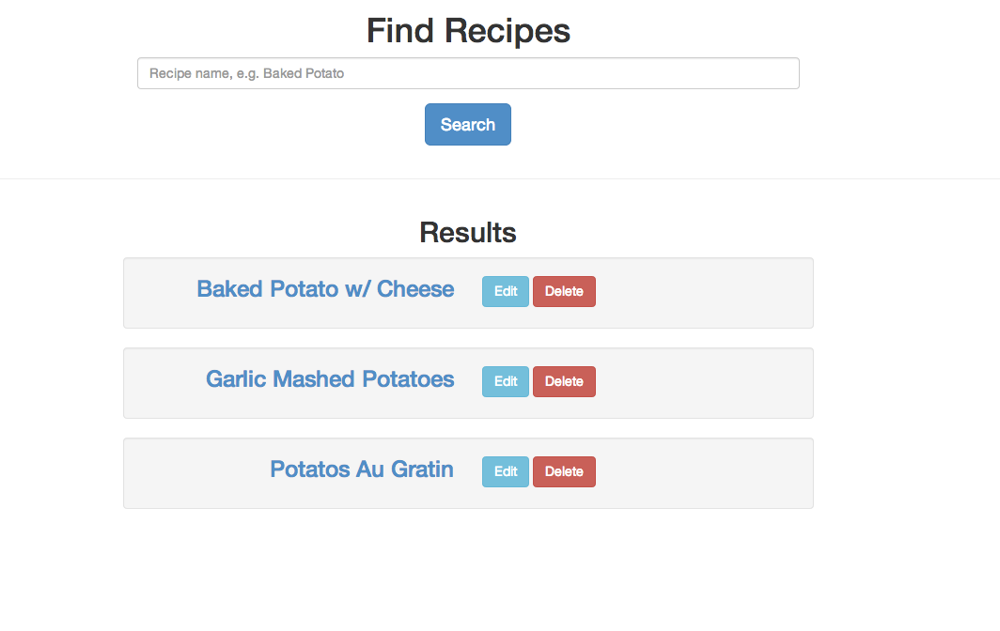
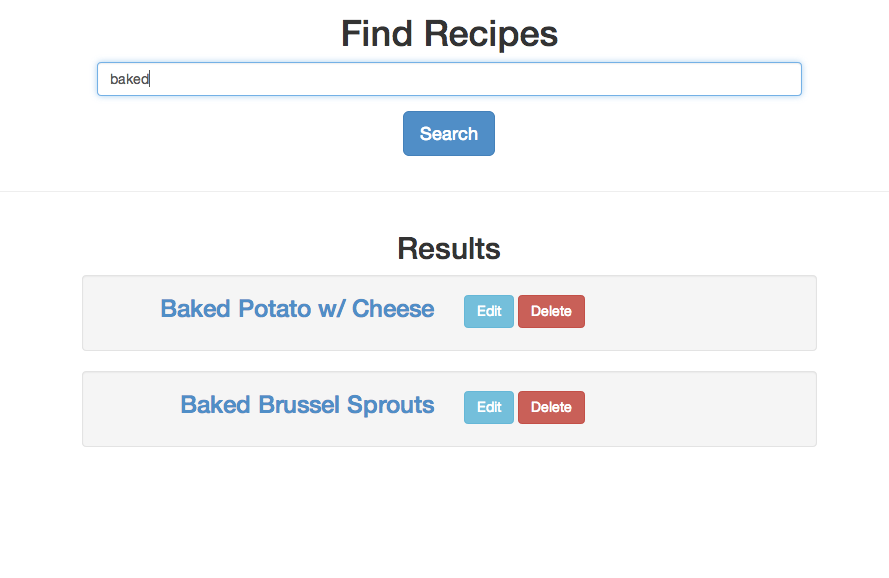

# Building the First Feature

Now that our application is set up with Angular and we have a way to manage
assets, we can start building an actual feature.  As mentioned earlier, we're
going to use tests to drive our work, but since this is the first feature
we're doing, it'll help to have a little bit of code in place before setting
up testing.

Although TDD is an effective practice, it is difficult to use it
to drive the _creation_ of an application, especially where new technology is
concerned.  Doing so creates too many new changes at once, making it difficult
to diagnose problems - did we mess up our testing configuration, or are there
deeper problems with the application code under test?

Instead of wrestling with these issues, we'll take a few baby steps, starting
with our UI and just a bit of application code.  We can verify this is working manually so that when we set up
our testing environment, we can focus on getting that working without *also* focusing on making
our application work.

This is what we're going to do:

1. Create a basic search UI
2. Write a small amount of code to make it work
3. Set up our JavaScript testing environment
4. Connect the back-end

## Basic UI

Since our application's views are not generally going to be served by Rails, the majority of our markup will live outside of a
Rails view.  With Angular, we'll map routes to views and controllers, like so:

```coffeescript
app.config([ '$routeProvider',
  ($routeProvider)->
    $routeProvider
      .when('/',
        templateUrl: "index.html"
        controller: 'SomeController'
      )
      .when('/recipes/new',
        templateUrl: "new.html"
        controller: 'SomeOtherController'
      )
])
```

This presents us with somewhat of a problem.  Angular is going to use the value of `templateUrl` to try to fetch the file we've
specified via AJAX.  This might actually work in development, but will certainly fail in production (and in subtle ways).
This is because the asset pipeline works different in production mode.

In production mode, the asset pipeline will control the path *and name* of assets it's serving.  Specifically, it will generate a
hash for each asset and include that hash in the name.  That means that if Angular requests `/assets/index.html`, it will get a
404, because the file's actual name will be something like `/assets/9834f200909a098a0a9a-index.html`.  More subtly,
`/assets/index.html` would work in Rails 3, but no longer works in Rails 4.

My initial search to solve this problem led me to a blog post that recommended using ERB, so that `app.coffee` could have access
to the `asset_path` helper, which accounts for the location and naming, like so:

```coffeescript
# This is app/assets/javascripts/app.coffee.erb

#= depend_on_asset index.html
#= depend_on_asset new.html
app.config([ '$routeProvider',
  ($routeProvider)->
    $routeProvider
      .when('/',
        templateUrl: "<%= asset_path('index.html') %>"
        controller: 'SomeController'
      )
      .when('/recipes/new',
        templateUrl: "<%= asset_path('new.html') %>"
        controller: 'SomeOtherController'
      )
])
```

As of Rails 4.0.3 there is a bug with Sprockets that prevents this from
working—Sprockets won't see that your templates have changed and `app.js`
won't be recompiled to reference the updated templates.

Even if that bug goes away, this solution still isn't great.  If you serve
your assets from a content delivery network (CDN) the browser will be unable
to access the templates at all.

The reason is that Angular will request those assets at runtime, from the
browser, and since your application isn't being served from your CDN, the
browser, as a security measure, will refuse to allow Angular to read those
assets.

One solution to **that** problem is to configure Cross Origin
Resource-Sharing (CORS), but this can be tricky to set up (or impossible, depending on your CDN).  It is also very difficult to
debug if it's not working properly.

What we'd like to do is skip all of this entirely.  Angular caches templates after it requests them the first time, so we really just
need to pre-populate that cache.  This way, Angular won't need to request *any* assets, thus eliminating both the asset pipeline
problem as well as the same-origin security policy.

Fortunately, the gem `angular-rails-templates` exists to do just that.

Let's add it to our `Gemfile`:

    git://receta.git/Gemfile#..add-angular-templates

Running `bundle install` will download the gem for us.

In addition to this gem, we're also going to need the `angular-route` module, which enables the routing we saw above.  We'll add
it to our `Bowerfile` first:

    git://receta.git/Bowerfile#..add-angular-route

Once we run `rake bower:install` to download `angular-route`, we'll need to reference it from our `application.js` file so it's
available to the app:

    git://receta.git/app/assets/javascripts/application.js#..add-angular-route

Now, let's write just enough Angular code to serve up a template, so we can work out the UI.  The first thing to do is to replace
`app/views/home/index.html.erb` with the markup needed to “boot” Angular when the view is rendered by Rails:

    git://receta.git/app/views/home/index.html.erb#static-template-renders

The use of `ng-app` tells Angular which application should be loaded, and the `ng-view` directive tells it where to render views.  The
`view-container` div, along with the `view-frame` and `animate-view` classes can be used to add view transition animations if we
want, but we can ignore them for now.

Next, we need to implement the `receta` Angular app so it renders a view.  Since we need the `angular-routes` module as well as
the Angular module provided by `angular-rails-templates`, our app definition will need to include them as dependencies.  We're
also going to put our controllers in their own module, so the `controllers` module will be a third dependency.

Our entire `app/assets/javascripts/app.coffee` now looks like so:

    git://receta.git/app/assets/javascripts/app.coffee#static-template-renders

The last thing to do is to create `index.html`.  `angular-rails-templates` will look for templates in
`app/assets/javascripts/templates` by default, so we'll put the file there. It
will initially just have static markup that demonstrates our UI.

    git://receta.git/app/assets/javascripts/templates/index.html#static-template-renders

Once we start our app, we'll see the view rendered, which should look like so:



Now, let's get the front-end working.

## Code to make it work

Normally, we'd start by writing a test, but since this is our very first feature, let's write the production code first so we
don't have to be distracted by setting up the testing framework and its requisite configuration.

Our controller is going to serve two purposes initially.  First, it needs to respond to the “Search” button and conduct the
search.  Second, it needs to provide search results to be rendered.

Since we don't have a back-end yet, we'll use canned data to get started.  Further, since we know that the back-end will
ultimately be conducting the search, we aren't going to design our controller and view around Angular filters.  Instead, we'll
simply expose the attribute `recipes` that will contain whatever the search results happen to be.

Finally, we'll design the controller to look for a url parameter called “keywords” and, if present, use that to conduct a search,
as opposed to doing the search in the `search()` action.  The `search()` action will simply route the application to `/` with
the keywords in the query string.  This allows our search results to be bookmarkable, which a very nice thing to do for our users.

Let's look at our controller code.

    git://receta.git/app/assets/javascripts/app.coffee#front-end-canned-search

First, we put in a canned list of recipes to search through.  Next, we've filled out the controller with the basics of
implementing the search.  Since we need access to the query string, as well as the ability to change the current route/url, we'll
add `$routeParams` and `$location` to our controller's dependencies.

Note the form of Angular dependency-injection we're using.  If we used name-based injection, like so

```coffeescript
controllers.controller('RecipesController',
  ($scope,$routeParams,$location)->
```

The function's argument names would be lost during minification.  Meaning, everything would work great in development and not
work at all in production.
It's a bit more verbose to do it with the string array, but
it's guaranteed to work through the asset pipeline and any minification or obfuscation that happens to the JavaScript.

The controller itself isn't terribly exciting.  Our `search()` function simply re-routes to ourself with the keywords in the
query string, and the controller's body does a simple substring lookup of our canned data (this line will ultimately change to
talk to the backend).

Now, let's look at our view.  We need to bind the value of the search field to a model, and use that value as the argument to
search, which we must trigger from the “Search” button.  We also will remove our duplicated markup in favor of markup for one
result, wrapped in an `ng-repeat` directive.

    git://receta.git/app/assets/javascripts/templates/index.html#..front-end-canned-search

Note that we're also using `ng-if` to hide the results section entirely if there aren't any results.

Now when we reload the page, our search works!



Before we move on, let's deploy to production to make sure that all of our configuration around the Angular templates is working
when the asset pipeline is in production mode.

```shell
> git push heroku master
> heroku open
```

Once your browser opens, you should see the app working the same as it did in your environment–our configuration is good.

Before we write too much more code, we need to get some tests in place.  First, we'll create a browser-based acceptance test to verify that
the search feature works.  That test won't be coupled to how the app is implemented, so we can use it to validate that we've hooked up the backend correctly.  We'll use unit tests of our Angular controller to drive that development.

## Tests

To conduct our browser-based tests, we'll use Capybara and Selenium.  First, we'll need to create `spec/spec_helper.rb` to setup
and configure our back-end and browser-based tests.

    git://receta.git/spec/spec_helper.rb#search-feature-spec

There's nothing particularly special in here, just what RSpec would normally set up for you.  The only different bit is toward
the end, where we change how the database is managed for browser-based tests.  Normally, tests run in a database transaction
that's rolled back after the test completes.  For the browser-based tests, that won't work because the browser is running in a
different process and can't see the effects of database changes that are in an uncommitted transaction.

With that set up, we'll create a simple feature spec to test the search:

    git://receta.git/spec/features/search_spec.rb#search-feature-spec

Since our test relies on the canned data that we hard-coded, it passes.

    git://receta.git/#search-feature-spec!rake spec

With this in place, we can now connect our front-end to the back-end, set up the same canned data from within our feature spec, and
expect the exact same results.

## Back-end

We have three main steps to connect our Angular controller to our backend:

1. Implement the search on the backend to return results in JSON
2. Have our Angular controller make an AJAX request to our backend
3. Have our feature spec insert the same test data that our Angular controller is currently hard-coding

### Implement the search

Since this isn't a Rails tutorial, we're going to go pretty fast here.  We're going to need a `Recipe` model, a
`RecipesController`, and a JSON view of the search results.

A Recipe is just going to be a name and some text, so we'll use the Rails generator to get us going.  We're going to skip
fixtures (and FactoryGirl) for now.

```shell
> rails g model Recipe name:string instructions:text --no-fixture  --no-fixture-replacement
      invoke  active_record
      create    db/migrate/20140309184135_create_recipes.rb
      create    app/models/recipe.rb
      invoke    rspec
      create      spec/models/recipe_spec.rb
> rake db:migrate
> rake db:migrate RAILS_ENV=test
```

Our `Recipe` model doesn't have any functionality, so we'll leave the auto-generated test alone.  What we need now is a
controller.  Let's use the rails generator again to create the necessary files.

Since there won't be an HTML view, there's no reason to have view specs, helpers, or assets, so we'll skip those when we run `rails g`

```shell
> rails g controller recipes index --no-view-specs --no-helper --no-assets
```

The generator creates a silly
entry in our `routes.rb` file, so we'll replace it with a more resource-oriented configuration:

    git://receta.git/config/routes.rb#create-recipe-controller

To implement the `index` method, we need two tests - one that should expect results and one that won't.  We'll also need to
tell our spec to render the views, so that we can parse the JSON that's returned and make sure it looks good.

    git://receta.git/spec/controllers/recipes_controller_spec.rb#recipes-index

We'll then make the test pass by doing the search in the controller, and create the appropriate JSON views.  First, the
controller:

    git://receta.git/app/controllers/recipes_controller.rb#recipes-index

We're not explicitly looking for any particular format.  Since we'll be requesting JSON, Rails will try to find a view that can
serve up JSON.  To do that, we'll create a view using [JBuilder].  Even though it might be a bit more code than allowing Rails to
convert the `Recipe` to JSON using its built-in serializers, I find using JBuilder creates a nice separation point between the
front-end and back-end.  This gives us flexibility to write idiomatic code on both sides, even when those idioms diverge (for
example, Angular code tends to favor camel-case, whereas Ruby tends to favor snake-case).

[JBuilder]: https://github.com/rails/jbuilder

First, we'll create `app/views/recipes/index.json.jbuilder`:

    git://receta.git/app/views/recipes/index.json.jbuilder#recipes-index

All this does is defer each recipe to a partial, which is in `app/views/recipes/_recipe.json.jbuilder` and looks like so:

    git://receta.git/app/views/recipes/_recipe.json.jbuilder#recipes-index

With all this in place, our test passes:

    git://receta.git/#recipes-index!rake db:migrate RAILS_ENV=test ; rspec spec/controllers/recipes_controller_spec.rb

Now that we have our back-end implemented, let's hook it up by having our Angular controller call it.

### Have angular controller call the back-end

Since this is the first real code we're writing in Angular, this is where we'll set up our unit testing.  We're going to use
`teaspoon`, which is a test runner for JavaScript that uses the asset pipeline, Jasmine, and PhantomJS.  We'll add teaspoon and
PhantomJS to our `Gemfile`:

    git://receta.git/Gemfile#setup-teaspoon^1..setup-teaspoon

Once we run `bundle install`, we need to bootstrap teaspoon, which can be done with the Rails generator it includes:

```shell
> rails generate teaspoon:install --coffee
```

We're also going to need two more Angular modules. We need `angular-mocks` to help with testing and `angular-resource` to
implement the AJAX calls.  First, we add them to `Bowerfile`:

    git://receta.git/Bowerfile#setup-teaspoon^1..setup-teaspoon

Once we run `rake bower:install` to download them, we need to add `angular-resource` to `application.js`:

    git://receta.git/app/assets/javascripts/application.js#setup-teaspoon^1..setup-teaspoon

Since `angular-mocks` is only needed for tests, we *won't* put it in `application.js`.  Teaspoon allows Sprockets directives in
our test files, and it generated `spec/javascripts/spec_helper.coffee` for us, which is included in all tests.  We'll add this
line to the file:

```coffeescript
#= angular-mocks/angular-mocks
```

The last step in setting up our front-end testing is to write a basic spec that uses our controller.  The boilerplate for this
test is somewhat substantial compared to a Rails controller test.  This is a function both of JavaScript as a language and the
way Angular is designed.

Since all Angular modules are functions that are given their dependencies, when we test those modules, we'll want to intercept
those dependencies so we can use them in our tests.  Although we could create mocks for many of our controller dependencies,
Angular provides mock implementationsn for us, and will pass those, by
default, to our controller.

If we need to examine them in a test (for example to assert that our
controller set the location to a particular path) we'll need to get a
reference to those mock instances.  At the very least, we need access to `$scope`, which is
how our controller provides data to the views (think of it as the `assigns` of
an Angular controller test).

To do this, we'll create a function called `setupController()` that uses the
Angular-provided method `$inject`, which will allow us access to the mock
dependencies.  We'll call this method in a `beforeEach` so our controller is
always ready to go before each test.

    git://receta.git/spec/javascripts/controllers/RecipesController_spec.coffee#setup-teaspoon

We need to declare our variables at the top so their references can “escape”
the closure created by `$inject`.  Also note that the reason we're making a
function, and not just putting this code at a top-level `beforeEach` is that
different tests will need to manipulate the `routeParams`, and that can only
be done during injection.


By the time our test runs, the controller will be up and running as if the user had just visited the page.  In this case,
`recipes` will be empty, so we assert that.  Notice that we can't use `expect(scope.recipes).toBe([])` because `toBe` creates a
very strong requirement that the result and the expected value are identical objects.  Instead, we're using `toEqualData`, which
is a matcher we've created in `spec_helper.coffee`:

    git://receta.git/spec/javascripts/spec_helper.coffee#setup-teaspoon

This does a “value” match, which will make our lives much easier when
asserting equality between objects.

Let's run our JavaScript tests to validate our setup.

    git://receta.git/#setup-teaspoon!rake teaspoon

Everything works!  Now, we just need a test that our controller calls the backend.

Our controller will need three tests:

* Check that on initialization with no keywords, `recipes` is empty (i.e. the test we already have)
* Check that on initialization *with* keywords, we call the backend and populate `recipes` with the results
* Verify that clicking `search()` redirects us back to ourselves with the correct query string

In order to test that we call the backend, we'll ask Angular to give us access to the mock HTTP backend it uses during tests.  We
can use that mock instance to mock a real back-end response.

Because the initialization of our controller will make this call, we'll need to set up our mock expectations inside
`setupController()`.  We'll add a second parameter—`results`—and arrange for `$httpBackend` to return it when the right AJAX request is made.

```coffeescript
setupController = (keywords,results)->
  inject(($location, $routeParams, $rootScope, $resource, $httpBackend, $controller)->
    scope       = $rootScope.$new()
    location    = $location
    resource    = $resource
    httpBackend = $httpBackend
    routeParams = $routeParams
    routeParams.keywords = keywords

    if results
      request = new RegExp('\/recipes.*keywords=#{keywords}')
      httpBackend.expectGET(request).respond(results)

    ctrl        = $controller('RecipesController',
                              $scope: scope
                              $location: location)
  )
```

We also need to tell `httpBackend` to verify that there are no unmet expectations nor are there unexpected requests:

```coffeescript
  afterEach ->
    httpBackend.verifyNoOutstandingExpectation()
    httpBackend.verifyNoOutstandingRequest()
```

Finally, we write our tests.  We'll set up two contexts, “controller initialization” and “search()”.  In “controller
initialization”, we have two tests.  The first is the one we already have:


```coffeescript
describe 'controller initialization', ->
  describe 'when no keywords present', ->
    beforeEach(setupController())

    it 'defaults to no recipes', ->
      expect(scope.recipes).toEqualData([])
```

The second is our back-end test.  We'll call `setupController()` with the keywords we want in the `routeParams` and the list of
recipes to return from the back-end:

```coffeescript
  describe 'with keywords', ->
    keywords = 'foo'
    recipes = [
      {
        id: 2
        name: 'Baked Potatoes'
      },
      {
        id: 4
        name: 'Potatoes Au Gratin'
      }
    ]
    beforeEach ->
      setupController(keywords,recipes)
      httpBackend.flush()

    it 'calls the back-end', ->
      expect(scope.recipes).toEqualData(recipes)
```

The call to `httpBackend.flush()` resolves all aysnchronous promises.  We'll expect this to set the controller's `recipes` to the
recipes we passed to `setupController()`.

Finally, we test that `search()` sets the URL correctly:

```coffeescript
describe 'search()', ->
  beforeEach ->
    setupController()

  it 'redirects to itself with a keyword param', ->
    keywords = 'foo'
    scope.search(keywords)
    expect(location.path()).toBe('/')
    expect(location.search()).toEqualData({keywords: keywords})
```

(note that `location.search()` has nothing to do with our controller method called `search()`.  `location.search()` represents the query string as a JavaScript object)

Let's run the test and watch it fail:

    git://receta.git/#angular-recipes-controller-test!rake teaspoon!nonzero

The test is failing just how we'd expect: there are no HTTP requests to flush, `recipes` is empty, and there is an unmet expected HTTP request.  Now, let's fix it.

The `angular-resource` module makes this very simple.  We create a resource for our recipes, and then call the `query()` method
(generated for us by Angular).

    git://receta.git/app/assets/javascripts/app.coffee#angular-controller-test-pass^1..angular-controller-test-pass

Now, let's re-run our tests:

    git://receta.git/#angular-controller-test-pass!rake teaspoon

Everything's passing!  At this point, our front-end will call through to our
Rails controller, parse the JSON it gets, and display the right results.  Our
browser-based test can assert this for us, provided it sets up the database
the same way we initially faked the data in our Angular controller.

### Re-run our feature spec

We can now remove `recipes` from `app.coffee` since we're talking to the real back-end.  The only problem is that `search_spec.rb`
is relying on that data being there to verify the feature is working. All we have to do is populate the database with the same
data.  We'll create it in a `before` block.

    git://receta.git/spec/features/search_spec.rb#backend-integrated^1..backend-integrated

Now, if everything's working, our test should still pass.

    git://receta.git/#backend-integrated!rspec spec/features/search_spec.rb

It's passing!  We've now successfully test-driven our first feature with Angular!

But, the TDD cycle isn't complete.  We've gone from a failing test (red) to a passing one (green), but we haven't refactored, yet.

The code we've written is minimal, however the implementation of `RecipesController` doesn't belong in `app.coffee`.  We'd like
our front-end code to be organized like our back-end code, with different modules in different files.

Let's extract the implementation of `RecipesController` out of
`app.coffee` and into `app/assets/javascripts/controllers/RecipesController.coffee`.  If we do that, and our test passes, it's a
good refactor.

First, we'll remove the controller from `app.coffee`, but notice that we leave in the module declaration:

    git://receta.git/app/assets/javascripts/app.coffee#extract-controller-to-file^1..extract-controller-to-file

We'll place the controller code in `app/assets/javascripts/controllers/RecipesController.coffee`, and notice that we have _repeated_ the module declaration (or so it seems):

    git://receta.git/app/assets/javascripts/controllers/RecipesController.coffee#extract-controller-to-file

Because the asset pipeline wraps
all CoffeeScript files in self-executing functions, our controller file won't have access to the `controllers` module we declared
in `app.coffee`.  We can still get access to it by calling `angular.module` in the controller file.  Since it will be evaluated *after* `app.coffee`, we can be sure the module itself exists inside the bowels of Angular. The important
difference is that in our controller file, we omit the second parameter.  This is how Angular knows we just want access to the
previously-declared module and aren't trying to declare a new module that has
the same name (which, incidentally, generates a runtime error).

If all went well, our tests should still be passing.  First, we run our unit tests:

    git://receta.git/#backend-integrated!rake teaspoon

Now, run our feature test:

    git://receta.git/#backend-integrated!rspec spec/features/search_spec.rb

Wonderful!  We now have a repeatable process for test-driving our Angular-and-Rails-powered web application.

In the next chapter, we'll use what we've set up to test-drive the “view” feature.
