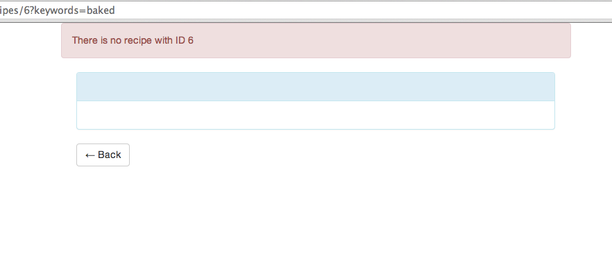

# Test-Driving the Next Feature

Now that we have Angular setup, including a way to manage front-end assets,
run tests, and deploy our application to production, the hard part is done.  In
this chapter, let's use what we've set up, along with some TDD, to implement
the ability to click on a recipe in the results list and view its
instructions.

In a classic Rails app, we'd have a method called `show` in our
`RecipesController`, which would be routed-to from `/recipes/:id`.  We'll do
something similar in our Angular app, however we won't add this feature to the
existing `RecipesController.coffee`, but a new controller called
`RecipeController`.

There's no advantage to having the existing `RecipesController.coffee`
handle the viewing of an individual recipe, other than saving us a bit of
setup in the test.   My feeling is that when there's no advantage over adding
code to an existing class or file, it's always better to make a new class or
file.

Generally, what we need to do here is:

1. Create our Angular controller
2. Create our backend Rails controller
3. Write a browser-based test for the feature
4. Create a view

## Angular controller

First, we'll update our Angular app config to route `/recipes/:recipeId` to
the yet-to-be-created `RecipeController`:

    git://receta.git/app/assets/javascripts/app.coffee#..add-recipe-controller

Now, let's create a bare-bones version of our controller:

    git://receta.git/app/assets/javascripts/controllers/RecipeController.coffee#add-recipe-controller

And the boilerplate needed for our test:

    git://receta.git/spec/javascripts/controllers/RecipeController_spec.coffee#add-recipe-controller

What `RecipeController` needs to do is:

* Load the recipe identified by `:recipeId` in the URL and set it to some variable in `$scope`
* If the recipe doesn't exist, handle that error somehow

Lets get the happy path working first:

    git://receta.git/spec/javascripts/controllers/RecipeController_spec.coffee#..recipe-controller-test

This is similar to what we had in `RecipesController_spec.coffee`.  Because
the HTTP call to our backend happens on controller startup, we create a
function `setupController()` that handles mocking out the HTTP calls.  It
takes a single parameter—`recipeExists`—to allow us to control whether or not
the backend sends a 404 or a real recipe.

Since none of this is implemented yet, our test should fail.  Let's try it:

    git://receta.git/#recipe-controller-test!rake teaspoon!nonzero

Sure enough, our test fails exactly how we'd like: `$scope.recipe` isn't
defined for either case, and no HTTP calls were made, despite our expectation
that they would be.

Let's make it pass.  We'll use Angular's `$resource` service to create the
same resource we did in `RecipesController`, but use the `get` method, which
does what we want.

    git://receta.git/app/assets/javascripts/controllers/RecipeController.coffee#..recipe-controller-test-passes

Now, we see if this makes our tests pass:

    git://receta.git/#recipe-controller-test-passes!rake teaspoon

It does!  

Although our code does technically handle the case of a missing recipe, it
doesn't handle it very well.  We'd like to pass onto the user some indication
that things went wrong.  In Rails, we'd use the flash as a way to provide such
information.

In Angular, we can certainly create our own flash by just assigning 
`{ error: “Recipe not found”}` to `$scope.flash`.  Instead, lets use a
pre-made module that will handle flash messages, but also allow us to display
them in our views.  `angular-flash` is that component, so let's install it.

First, we add it to `Bowerfile`:

    git://receta.git/Bowerfile#..install-angular-flash

To make sure the asset pipeline picks up this new dependency, we'll need to
add it to `application.js` as well:

    git://receta.git/app/assets/javascripts/application.js#..angular-flash-in-application-js

Note the slightly different path to the file we want–this is the lack of
standardization across front-end components rearing its ugly head.

Finally, we add it as a module dependency to our app.  `angular-flash` comes with
two modules, one for the flash data itself, and another for the view
components.

    git://receta.git/app/assets/javascripts/app.coffee#..install-angular-flash

We'll see how the view components work a bit later, but for now, our
controller can depend on a component called `flash`.  `flash` allows us to set
errors, warnings, informational messages, and success messages.

Back to our test, we want to assert that the flash receives an error message that the
recipe couldn't be found.  

    git://receta.git/spec/javascripts/controllers/RecipeController_spec.coffee#..test-recipe-controller-for-flash

Notice that we're taking advantage of Angular's
alternate dependency injection naming convention.  We want our test to use an object called
`flash` to make assertions, but since this component isn't provided by
Angular, it's name—for dependency injection purposes—is also `flash`, meaning we'd
need to use a different name for the flash in our tests.  Angular allows us to
name the _parameter_ with leading and trailing underscores, e.g. `_flash_`.
When we do this, Angular understands that the object `flash` should be injected. This means
that the name of the object that “escapes” the closure can be named `flash`.  Ah, JavaScript!

Now, when we run the test, we should see a simple expectation failure on the message.

    git://receta.git/#test-recipe-controller-for-flash!rake teaspoon!nonzero

With a clearly failing test, we just need to add the flash as a dependency, and use it.

    git://receta.git/app/assets/javascripts/controllers/RecipeController.coffee#..test-for-flash-passes

We add `flash` to the list of injected dependencies, and then set the error message in our failure callback.  Sure enough, the test passes:

    git://receta.git/#test-for-flash-passes!rake teaspoon

Our Angular controller is done!  We still need a view, a browser-based test, and the backend.  Let's do the Rails backend next.

## Rails controller

In the Rails world, it is canonical to have the same controller have the code for both `index`
and `show`, so what we need to do here is implement `show`.

First, let's add the new route to `config/routes.rb`:

    git://receta.git/config/routes.rb#..failing-recipe-show

We'll add an empty `show` method to the controller as well:

    git://receta.git/app/controllers/recipes_controller.rb#..failing-recipe-show

Finally, we'll write tests for when the recipe exists and for when it doesn't:

    git://receta.git/spec/controllers/recipes_controller_spec.rb#..failing-recipe-show

This should result in a failing test, which it does:

    git://receta.git/#failing-recipe-show!rspec spec/controllers/recipes_controller_spec.rb!nonzero

To make this pass, we'll fetch the recipe:

    git://receta.git/app/controllers/recipes_controller.rb#..recipe-show-passes

and implement a JBuilder view that uses our existing `_recipe.json.jbuilder` partial:

    git://receta.git/app/views/recipes/show.json.jbuilder#recipe-show-passes

To handle the case of a non-existent recipe, we'll let the
`ActiveRecord::RecordNotFound` leak out of our controller, and use
`rescue_from` in `ApplicationController` to handle that.  This way, we never
have to worry about translating this error into a 404 again.

    git://receta.git/app/controllers/application_controller.rb#..recipe-show-passes

Now, everything passes!

    git://receta.git/#recipe-show-passes!rspec spec/controllers/recipes_controller_spec.rb

Let's bring it all together with a browser-based test.

## Browser-based test

Our browser-based test will simulate a user using our app, so we'll first do a
search, and then navigate to a specific recipe.  We'll then check that the
resulting view shows the title *and* instructions.  We'll also navigate back
to our results, assuming the existence of a “back” button.

    git://receta.git/spec/features/view_spec.rb#view-spec

Running the test fails:

    git://receta.git/#view-spec!rspec spec/features/view_spec.rb!nonzero

If you recall, we just used an `href` of `#` around the recipe name in the
search results.  Clicking that essentially clears the search and starts over.  

We'll need to change that `a` to route us to `/recipes/:recipeId`, as well
as actually build out the “show” view.

First, we'll change the `a`:

    git://receta.git/app/assets/javascripts/templates/index.html#..view-integrated

Notice that we removed the argument to `href`, which will keep the browser
from changing its location and reloading our view.  Instead, we used
`ng-click` to trigger the `view()` method that we'll now add to
`RecipesController`:

    git://receta.git/app/assets/javascripts/controllers/RecipesController.coffee#..view-integrated

All that's left is to create the view in `show.html`:

    git://receta.git/app/assets/javascripts/templates/show.html#view-integrated

We'll also add a method to make the “Back” button work:

    git://receta.git/app/assets/javascripts/controllers/RecipeController.coffee#..add-back-button

Now, everything works:

    git://receta.git/#view-integrated!rspec spec/features/view_spec.rb

We added the back button and function specifically to call out a gap between
what we get with Angular and what we get with Rails, with respect to view and
controller implementation.

We've already seen that Angular's router requires more explicit configuration
than Rails'.  We can also now see that we don't get convenient methods like
`recipes_path` or `recipe_path(recipe)` to generate routes for us.  There
doesn't seem to be a canonical way to do this at this time.

There's one last thing to do, and that's integrate the flash message.  

## Flash message

Although we hope to not generate links to non-existent
recipes, it's still possible it could happen and, unlike a web app where a 404 will send us to a special page, since our Angular
app is using AJAX requests, we'll have to do _something_ if we get an error from the backend.  We test-drove setting an error
message in the flash, so now we just need to show it in our view.

The `angular-flash` module we installed has two parts. The first, which we've already seen, is a place to store flash messages.
The second is to allow your view to “subscribe” to them, which means that you can arrange for markup to be shown if there is a
flash message.

Because this is not something a user will ever be intended to see, and is also very simple, we're not going to write a test for it.  If there were more
complex logic around the flash, and its message, a test would be more useful, but for this case, it's not really worth it.

First, we'll add the necessary markup to `show.html`:

    git://receta.git/app/assets/javascripts/templates/show.html#..integrate-flash

Our `article` tag has three special attributes, provided by `angular-flash`: 

* `flash-alert` which binds this markup to the contents of the flash
* `duration` which we can use to “fade out” the flash after a time
* `active-class`, a class that will be added to this element when the flash has a value

The second thing we need to do is to configure `angular-flash` so that it knows about the various alert classes that Bootstrap
provides.  We do this in the app config in `app.coffee`:

    git://receta.git/app/assets/javascripts/app.coffee#..integrate-flash

What this configuration means is that if there is, for example, a value in `flash.error`, `angular-flash` will add the class
`alert-danger` to the flash element.  Since we also configured that element to add `alert` to *any* flash message, our markup
will be styled with the class `alert alert-danger` which is what Bootstrap needs to show an alert.

Now, let's navigate to a non-existent recipe and see it in action:

Perfect!

Now that we've seen how we can use TDD for all aspects of our feature, let's
add the create, update, and destroy features.  We'll do this very quickly as a
way to demonstrate what the code looks like.  You probably wouldn't add all of
these at the same time in your “real” application.
